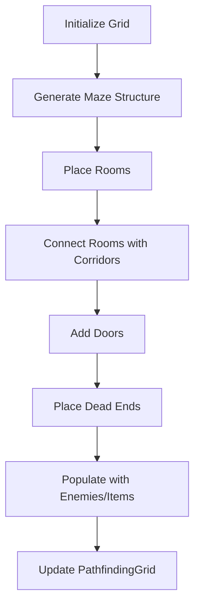

# How the Current Map System Works and Adapting It for Maze Generation

## Current Map System Overview

The current map system is built on a **static tilemap foundation** that uses Tiled Map Editor files to define the dungeon layout. [1](#0-0)  The map consists of a 75×80 tile grid with multiple layers including Floor, FloorDecor, Walls, and object layers for Rooms, Enemies, Props, and Items.

## How the Current System Works

### 1. **Static Room Definition**
The game currently uses **5 predefined rooms** with linear progression (Room 1 → Room 2 → Room 3 → Room 4 → Room 5). [2](#0-1)  Each room is defined by boundary zones, enemy trigger zones, and door connections that are loaded from the tilemap data.

### 2. **Room Management System**
The `RoomManager` class handles room initialization by:
- Loading room objects from the tilemap's object layers [3](#0-2) 
- Setting up enemy triggers for each room [4](#0-3) 
- Managing door states and connections between rooms [5](#0-4) 

### 3. **Room State Management**
Each room operates with a state machine (CREATED → TRIGGERED → SPAWNING → RESPAWN → ROOM_CLEARED) that controls enemy spawning and door opening. [6](#0-5)  When a room is cleared, its doors automatically open to allow progression. [7](#0-6) 

### 4. **Pathfinding Integration**
The system uses a `PathfindingGrid` that creates a navigation grid from the tilemap for enemy movement. [8](#0-7) 

## Adapting for Maze Generation

To transform this system into a procedural maze generator with multiple rooms, doors, and dead ends, you would need to implement the following architectural changes:

### 1. **Dynamic Tilemap Generation**
Replace the static tilemap loading with runtime generation:
- Create a `MazeGenerator` class that generates wall/floor tile data procedurally
- Replace the static tilemap setup [1](#0-0)  with dynamic tilemap creation
- Generate the walls layer data programmatically instead of loading from file

### 2. **Procedural Room System**
Extend the existing room management to support non-linear layouts:
- Modify `RoomManager.initializeRooms()` [9](#0-8)  to accept generated room data instead of tilemap objects
- Implement maze algorithms (recursive backtracking, Prim's algorithm, or cellular automata) to generate room layouts
- Create a graph-based room connection system to support multiple paths and dead ends

### 3. **Dynamic Door Management**
Enhance the door system for maze connectivity:
- Modify the door setup logic [10](#0-9)  to handle multiple doors per room
- Implement door placement algorithms that ensure proper maze connectivity
- Add support for locked doors that require keys or completing specific rooms

### 4. **Adaptive Enemy Spawning**
Update the enemy system for procedural content:
- Modify the enemy trigger setup [11](#0-10)  to work with generated room layouts
- Implement difficulty scaling based on room depth or distance from start
- Add randomized enemy type selection for each generated room

### 5. **Maze Generation Algorithm Implementation**

Here's a high-level approach for implementing the maze generation:



### 6. **Integration Points**
Key areas in the codebase that need modification:

- **Scene Setup**: Replace static map loading [12](#0-11)  with procedural generation calls
- **Pathfinding Update**: Ensure the pathfinding grid [8](#0-7)  regenerates with the new maze layout
- **Room State Logic**: The existing room state system [13](#0-12)  can be reused but needs to handle variable room connections

## Implementation Strategy

1. **Create a `MazeGenerator` class** that generates tilemap data at runtime
2. **Extend `RoomManager`** to accept procedurally generated room data
3. **Implement maze algorithms** (recursive backtracking recommended for dungeon-like mazes)
4. **Add room templates** that can be randomly placed and connected
5. **Update the pathfinding system** to work with the new dynamic layout
6. **Modify enemy and item placement** to work with generated room data

## Notes

The current system provides a solid foundation for maze generation because:
- The room-based architecture already supports multiple interconnected spaces
- The door system can be extended to support multiple connections per room
- The pathfinding grid can be regenerated for any new layout
- The enemy spawning system is flexible enough to work with procedural rooms

The main challenge is replacing the static tilemap dependency with dynamic generation while maintaining the existing game mechanics and state management systems.


# Procedural Maze Generation Implementation Guide

Here's a comprehensive code implementation guide for transforming the stellar-flame/browser-game from a static room system to a procedural maze generator:

## 1. Create a Maze Generator Class

```typescript
// src/objects/maze/MazeGenerator.ts
export interface MazeRoom {
  id: string;
  x: number;
  y: number;
  width: number;
  height: number;
  connections: { direction: DoorDirection; targetRoomId: string }[];
  isDeadEnd: boolean;
}

export interface MazeData {
  rooms: MazeRoom[];
  wallTiles: { x: number; y: number }[];
  floorTiles: { x: number; y: number }[];
  doors: { x: number; y: number; direction: DoorDirection; roomId: string }[];
}

export class MazeGenerator {
  private gridWidth: number;
  private gridHeight: number;
  private roomSize: number = 5; // rooms are 5x5 tiles
  private corridorWidth: number = 3;

  constructor(gridWidth: number = 25, gridHeight: number = 25) {
    this.gridWidth = gridWidth;
    this.gridHeight = gridHeight;
  }

  public generateMaze(): MazeData {
    // Use recursive backtracking algorithm
    const maze = this.createEmptyMaze();
    const visited = new Set<string>();
    const stack: { x: number; y: number }[] = [];
    
    // Start from random position
    const startX = Math.floor(Math.random() * this.gridWidth);
    const startY = Math.floor(Math.random() * this.gridHeight);
    
    stack.push({ x: startX, y: startY });
    visited.add(`${startX},${startY}`);

    while (stack.length > 0) {
      const current = stack[stack.length - 1];
      const neighbors = this.getUnvisitedNeighbors(current.x, current.y, visited);
      
      if (neighbors.length > 0) {
        const next = neighbors[Math.floor(Math.random() * neighbors.length)];
        this.removeWallBetween(maze, current, next);
        visited.add(`${next.x},${next.y}`);
        stack.push(next);
      } else {
        stack.pop();
      }
    }

    return this.convertMazeToRoomData(maze);
  }

  private createEmptyMaze(): boolean[][] {
    // Initialize maze with all walls
    const maze: boolean[][] = [];
    for (let y = 0; y < this.gridHeight; y++) {
      maze[y] = [];
      for (let x = 0; x < this.gridWidth; x++) {
        maze[y][x] = false; // false = wall, true = passage
      }
    }
    return maze;
  }

  private getUnvisitedNeighbors(x: number, y: number, visited: Set<string>): { x: number; y: number }[] {
    const neighbors = [];
    const directions = [
      { x: 0, y: -2 }, // North
      { x: 2, y: 0 },  // East
      { x: 0, y: 2 },  // South
      { x: -2, y: 0 }  // West
    ];

    for (const dir of directions) {
      const newX = x + dir.x;
      const newY = y + dir.y;
      
      if (newX >= 0 && newX < this.gridWidth && 
          newY >= 0 && newY < this.gridHeight && 
          !visited.has(`${newX},${newY}`)) {
        neighbors.push({ x: newX, y: newY });
      }
    }
    
    return neighbors;
  }

  private removeWallBetween(maze: boolean[][], current: { x: number; y: number }, next: { x: number; y: number }): void {
    const wallX = current.x + (next.x - current.x) / 2;
    const wallY = current.y + (next.y - current.y) / 2;
    
    maze[current.y][current.x] = true;
    maze[next.y][next.x] = true;
    maze[wallY][wallX] = true;
  }

  private convertMazeToRoomData(maze: boolean[][]): MazeData {
    const rooms: MazeRoom[] = [];
    const wallTiles: { x: number; y: number }[] = [];
    const floorTiles: { x: number; y: number }[] = [];
    const doors: { x: number; y: number; direction: DoorDirection; roomId: string }[] = [];

    let roomId = 1;

    // Convert maze cells to rooms
    for (let y = 0; y < this.gridHeight; y += 2) {
      for (let x = 0; x < this.gridWidth; x += 2) {
        if (maze[y][x]) {
          const room = this.createRoomFromMazeCell(x, y, roomId.toString(), maze);
          rooms.push(room);
          roomId++;
        }
      }
    }

    // Generate tiles and doors
    this.generateTilesAndDoors(maze, rooms, wallTiles, floorTiles, doors);

    return { rooms, wallTiles, floorTiles, doors };
  }

  private createRoomFromMazeCell(x: number, y: number, id: string, maze: boolean[][]): MazeRoom {
    const worldX = x * 32 * this.roomSize;
    const worldY = y * 32 * this.roomSize;
    const width = this.roomSize * 32;
    const height = this.roomSize * 32;

    const connections = this.findConnections(x, y, maze);
    const isDeadEnd = connections.length === 1;

    return {
      id,
      x: worldX,
      y: worldY,
      width,
      height,
      connections,
      isDeadEnd
    };
  }

  private findConnections(x: number, y: number, maze: boolean[][]): { direction: DoorDirection; targetRoomId: string }[] {
    const connections = [];
    const directions = [
      { x: 0, y: -1, dir: DoorDirection.North },
      { x: 1, y: 0, dir: DoorDirection.East },
      { x: 0, y: 1, dir: DoorDirection.South },
      { x: -1, y: 0, dir: DoorDirection.West }
    ];

    for (const direction of directions) {
      const checkX = x + direction.x;
      const checkY = y + direction.y;
      
      if (checkX >= 0 && checkX < this.gridWidth && 
          checkY >= 0 && checkY < this.gridHeight && 
          maze[checkY][checkX]) {
        connections.push({
          direction: direction.dir,
          targetRoomId: this.calculateRoomId(checkX, checkY)
        });
      }
    }

    return connections;
  }

  private calculateRoomId(x: number, y: number): string {
    return ((y / 2) * (this.gridWidth / 2) + (x / 2) + 1).toString();
  }

  private generateTilesAndDoors(
    maze: boolean[][], 
    rooms: MazeRoom[], 
    wallTiles: { x: number; y: number }[], 
    floorTiles: { x: number; y: number }[], 
    doors: { x: number; y: number; direction: DoorDirection; roomId: string }[]
  ): void {
    // Implementation for converting maze data to tile positions and door locations
    // This would populate the arrays with specific tile coordinates
  }
}
```

## 2. Modify MainScene to Use Procedural Generation [1](#1-0) 

Replace the static map setup with procedural generation:

```typescript
// src/scenes/MainScene.ts - Modified setupMap method
private setupMap() {
  // Generate maze data
  const mazeGenerator = new MazeGenerator(25, 25);
  const mazeData = this.generateProceduralMap(mazeGenerator);
  
  // Create tilemap from generated data
  const map = this.createTilemapFromMazeData(mazeData);
  const tileset = map.addTilesetImage('tiles-32', 'tiles-32');

  if (!tileset) {
    console.error('Failed to load tilesets');
    return;
  }

  // Create layers from generated data
  const floorLayer = this.createFloorLayer(map, tileset, mazeData);
  const floorDecorLayer = map.createLayer('FloorDecor', tileset, 0, 0);
  this.wallsLayer = this.createWallsLayer(map, tileset, mazeData);

  // Apply existing layer configurations
  if (floorLayer) {
    floorLayer.setAlpha(1);
    floorLayer.setDepth(-1);
    floorLayer.setPipeline('TextureTintPipeline');
    floorLayer.setScrollFactor(1);
    floorLayer.setCullPadding(32, 32);
  }

  if (this.wallsLayer) {
    this.wallsLayer.setCollisionFromCollisionGroup();
    this.wallsLayer.setPipeline('TextureTintPipeline');
    this.wallsLayer.setScrollFactor(1);
    this.wallsLayer.setCullPadding(32, 32);
  }
}

private generateProceduralMap(mazeGenerator: MazeGenerator): MazeData {
  return mazeGenerator.generateMaze();
}

private createTilemapFromMazeData(mazeData: MazeData): Phaser.Tilemaps.Tilemap {
  // Create a blank tilemap with calculated dimensions
  const mapWidth = Math.max(...mazeData.rooms.map(r => r.x + r.width)) / 32;
  const mapHeight = Math.max(...mazeData.rooms.map(r => r.y + r.height)) / 32;
  
  return this.make.tilemap({
    tileWidth: 32,
    tileHeight: 32,
    width: mapWidth,
    height: mapHeight
  });
}

private createFloorLayer(map: Phaser.Tilemaps.Tilemap, tileset: Phaser.Tilemaps.Tileset, mazeData: MazeData): Phaser.Tilemaps.TilemapLayer {
  const layer = map.createBlankLayer('Floor', tileset, 0, 0);
  
  // Place floor tiles based on generated data
  mazeData.floorTiles.forEach(tile => {
    layer?.putTileAt(1, tile.x, tile.y); // Use appropriate floor tile index
  });
  
  return layer!;
}

private createWallsLayer(map: Phaser.Tilemaps.Tilemap, tileset: Phaser.Tilemaps.Tileset, mazeData: MazeData): Phaser.Tilemaps.TilemapLayer {
  const layer = map.createBlankLayer('Walls', tileset, 0, 0);
  
  // Place wall tiles based on generated data
  mazeData.wallTiles.forEach(tile => {
    layer?.putTileAt(18, tile.x, tile.y); // Use appropriate wall tile index
  });
  
  return layer!;
}
```

## 3. Modify RoomManager for Dynamic Rooms [2](#1-1) 

Replace the tilemap-based room initialization:

```typescript
// src/objects/rooms/RoomManager.ts - Modified initializeRooms method
public initializeRooms(mazeData: MazeData): void {
  // Create rooms from generated maze data instead of tilemap objects
  mazeData.rooms.forEach(roomData => {
    const room = this.createFromMazeData(roomData);
    if (room) {
      this.rooms.set(roomData.id, room);
      this.scene.physics.add.overlap(this.player, room.getZone(), () => {
        this.handleRoomEntry(room);
      });
    }
  });

  // Set starting room (first room or specific starting room)
  this.currentRoom = this.rooms.get("1") || null;

  // Setup doors from maze data
  mazeData.doors.forEach(doorData => {
    const room = this.rooms.get(doorData.roomId);
    if (room) {
      this.setupDoorFromMazeData(doorData, room);
    }
  });

  // Setup enemy triggers for each room
  mazeData.rooms.forEach(roomData => {
    const room = this.rooms.get(roomData.id);
    if (room) {
      this.setupEnemyTriggerFromMazeData(roomData, room);
    }
  });
}

private createFromMazeData(roomData: MazeRoom): Room | null {
  return new Room(
    this.scene,
    roomData.id,
    roomData.x,
    roomData.y,
    roomData.width,
    roomData.height
  );
}

private setupDoorFromMazeData(doorData: { x: number; y: number; direction: DoorDirection; roomId: string }, room: Room): void {
  const door = new Door(
    this.scene,
    doorData.x * 32 + 16, // Convert grid to world coordinates
    doorData.y * 32 + 16,
    false, // Start closed
    doorData.roomId,
    doorData.direction
  );

  const collider = this.scene.physics.add.collider(this.player, door);
  door.setCollider(collider);
  room.addDoor(door);
}

private setupEnemyTriggerFromMazeData(roomData: MazeRoom, room: Room): void {
  // Create enemy trigger zone in center of room
  const triggerWidth = roomData.width * 0.8;
  const triggerHeight = roomData.height * 0.8;
  
  const zone = this.scene.add.zone(
    roomData.x + roomData.width / 2,
    roomData.y + roomData.height / 2,
    triggerWidth,
    triggerHeight
  );
  
  room.setEnemyTriggerZone(zone);
  
  this.scene.physics.world.enable(zone);
  (zone.body as Physics.Arcade.Body).setAllowGravity(false);
  (zone.body as Physics.Arcade.Body).moves = false;

  if (this.player) {
    this.scene.physics.add.overlap(this.player, zone, () => {
      if (room.isCreated()) {
        room.triggerRoom();
      }
    });
  }
}
```

## 4. Update MainScene Room Setup [3](#1-2) 

Modify the room setup to use maze data:

```typescript
// src/scenes/MainScene.ts - Modified setupRooms method
private setupRooms() {
  this.roomManager = new RoomManager(this, this.player);
  
  // Generate maze data and pass to room manager
  const mazeGenerator = new Ma

Wiki pages you might want to explore:
- [Overview (stellar-flame/browser-game)](/wiki/stellar-flame/browser-game#1)
- [Map Structure and Rooms (stellar-flame/browser-game)](/wiki/stellar-flame/browser-game#4.1)